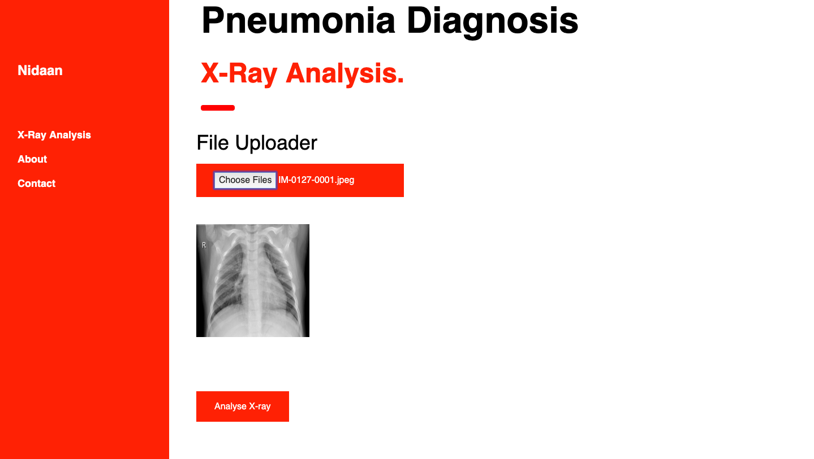
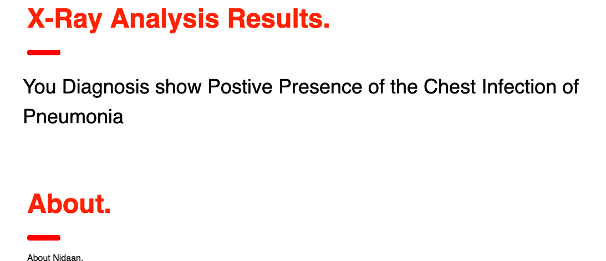

.note+p { /*next paragraph after 

*/
    padding: 8px 35px 8px 14px;
    margin-bottom: 20px;
    text-shadow: 0 1px 0 rgba(255,255,255,0.5);
    border-radius: 4px;
    color: #3a87ad;
    background-color: #d9edf7;
    border-color: #bce8f1;
}

.note+p:before { /*aditionally prepend `⚠ Note:` to message: */ 
    content: "⚠ Note:";
    font-weight: bold;
    display: block;
}

# Disease and Infected Area Recognition | X-ray Analysis - CNN | Epidemic Detection - Clustering and Safe Area Marking

       
**NOTE**: Source [here](//developer.run)

## Overview

In this project we do disease recognition through two possible and feasible ways of Image Processing and symptoms analysis using state of the art Convolutional Neural Network , KMeans and Support Vector Classifier of Deep learning and machine learning techniques . We aim to cluster patients with similar symptoms located closely on geo-location using ML clustering algorithms and plot the infected polygons on a map template for analysis and quick actions. Further it could be extended to identification of blood donation requirement areas and also medicine prespcription based on the data and provide relevant surveys.

## App UI
### Upload Page

### Result Page

